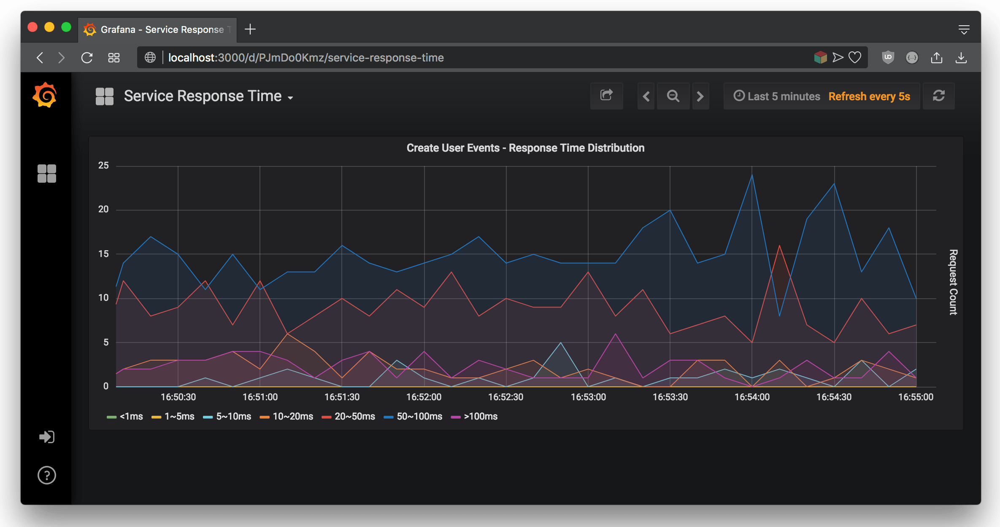

# User Event Store

## Pre-requests

ℹ️  Make sure docker and docker-compose are installed on the system, and docker daemon is running:

```bash
➜  docker info
Client:
 Version:      18.03.1-ce
 API version:  1.37
 Go version:   go1.9.5
 Git commit:   9ee9f40
 Built:        Thu Apr 26 07:13:02 2018
 OS/Arch:      darwin/amd64

(...some other information...)

➜  docker-compose -v
docker-compose version 1.16.1, build 6d1ac21
```


## Building & Running the Application Stack

To build & run application stack:

```bash
➜  docker-compose -p user-event-store -f dc-user-event-store.yml up -d --build 
```

Please wait until all applications are healthy. You can check each container status with:

```bash
➜  docker-compose -p user-event-store -f dc-user-event-store.yml ps
               Name                              Command                  State       
--------------------------------------------------------------------------------------
user-event-store_cassandra_1          docker-entrypoint.sh sh /i ...   Up (healthy)   
user-event-store_elasticsearch_1      /usr/local/bin/docker-entr ...   Up (healthy)   
user-event-store_grafana_1            /run.sh                          Up (healthy)   
user-event-store_logstash_1           /usr/local/bin/docker-entr ...   Up (healthy)   
user-event-store_user-event-store_1   ./app                            Up (healthy)   
```

## Generate Metric Data

You can use `generate-metric-data.sh` script for generating server-response-time metrics. 

```bash
➜  sh ./generate-metric-data.sh 

 This script will be running in an infinite loop. To stop it use Ctrl+C
.......................................
```

## Metrics Dashboard

To view server-reponse-time metric dashboard, navigate to [Grafana Dashboard](http://localhost:3000/d/PJmDo0Kmz/service-response-time)



## API Documentation

### Store User Event Service

**Request Method Signature**

```bash
POST http://<host>:8080/user-event
{
	"apiKey":    <apiKey>,
	"userId":    <userId>,
	"timestamp": <timeStamp>
}
```

**Success Response**

```bash
{
    "status": "SUCCESS",
    "data": {
		"apiKey":    <apiKey>,
		"userId":    <userId>,
		"timestamp": <timeStamp>
    }
}
```

|Pameter|Type|Meaning|
|---|---|---|
| data |string| Contains response object details |
| apiKey |string|API_KEY that assigned to user |
| userId |integer|User id |
| timestamp |datetime (format: 2006-01-02T15:04:05.000Z07:00)| Event time |


**Error Response**

```bash
{
    "status": "ERROR",
    "errorMessage": "<errorMessage>"
}
```

|Pameter|Type|Meaning| Format|
|---|---|---|---|
| errorMessage |string|Reason of the application  error|lower-case plain text|


